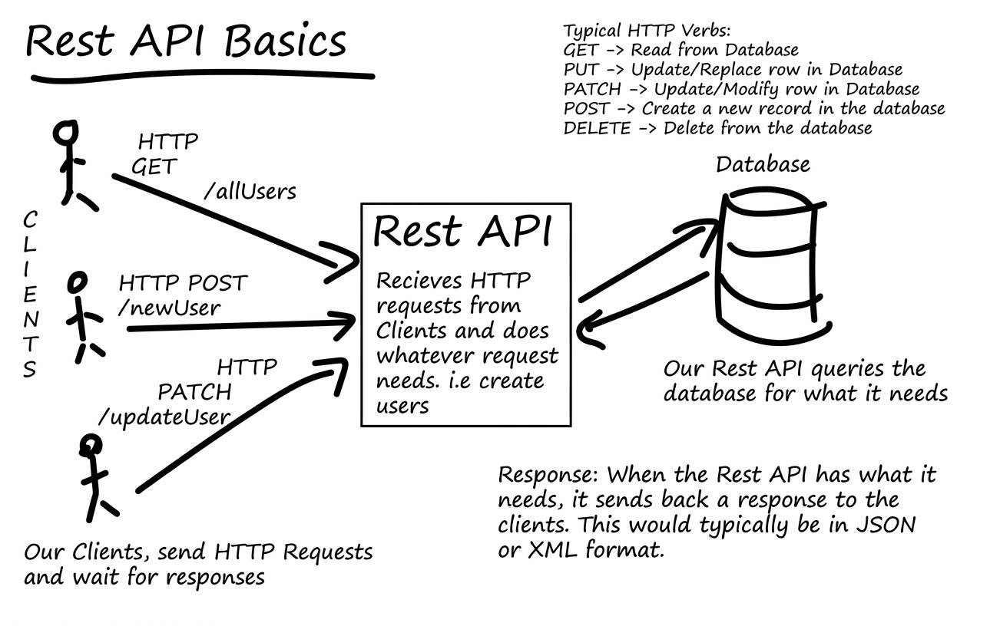
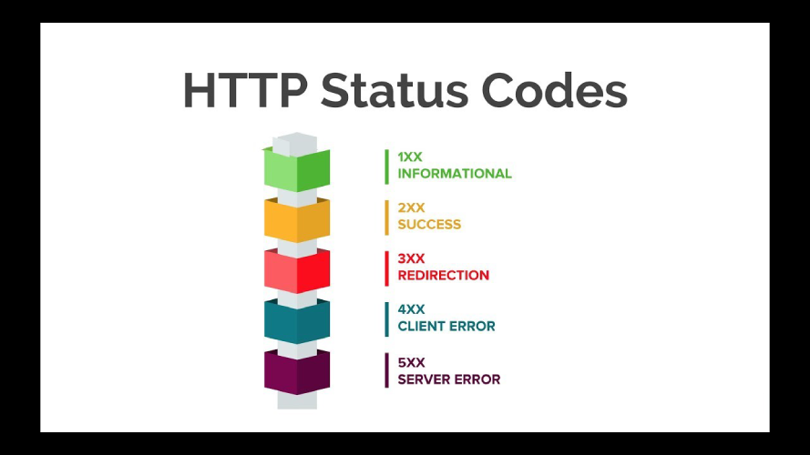
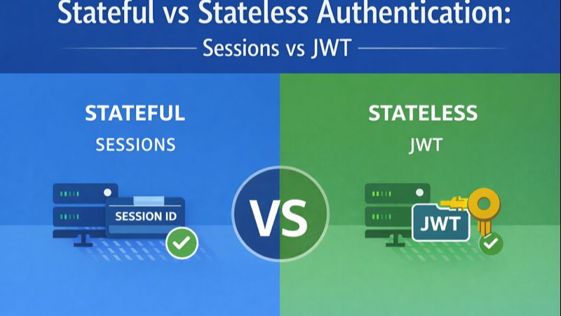

# Express JS

Node.js has a built-in HTTP tool to build web servers, but it is raw and requires a lot of manual, repetitive code. Express is a layer on top of Node.js that gives you shortcuts. It makes handling URLs, reading incoming data, and sending back responses much faster and cleaner.

## Versoning

Example: 5.2.1

1st Part - 5 - Major / Breaking update

2nd Part - 2 - Critical bug fix | Added a feature (recommended)

3rd Part - 1 - Minor fixes (optional update)

## Restfull API

These are the standard practices:

1- Server and Client Relationship: The server is responsible for handling requests and sending responses, while the client initiates requests and processes responses. You should be aware that the server and client are separate entities that communicate over HTTP. For instance, the server should render HTML if the client is a browser, while the server should send JSON if the client is a mobile app. The server should not assume that the client is a browser and should not send HTML to a mobile app. The server should also not assume that the client is a mobile app and should not send JSON to a browser.

2- HTTP Methods: Use appropriate HTTP methods (GET, POST, PUT, DELETE) to perform CRUD operations on resources.

3- Resource Identification: Use meaningful and descriptive URLs to identify resources (e.g., /users)

## MiddleWare

Express is a routing and middleware web framework that has minimal functionality of its own: An Express application is essentially a series of middleware function calls.

Middleware functions are functions that have access to the request object (req), the response object (res), and the next middleware function in the application’s request-response cycle. The next middleware function is commonly denoted by a variable named next.

Middleware functions can perform the following tasks:

Execute any code.
Make changes to the request and the response objects.
End the request-response cycle.
Call the next middleware function in the stack.
If the current middleware function does not end the request-response cycle, it must call next() to pass control to the next middleware function. Otherwise, the request will be left hanging.

## Headers

Headers are the part of api request and response that contain metadata about the request or response. Headers can include information such as content type, authentication tokens, caching directives, and more.

## HTTP codes

## Authentication

Stateful authentication keeps track of active user sessions on the server, usually by storing session details in memory or a database. Stateless authentication, on the other hand, relies on self-contained tokens (like JWTs) sent with every request.

## Useful Sites

<https://www.postman.com/downloads>

<https://expressjs.com/en>

<https://ejs.co>

<https://www.mongodb.com/docs/v7.0/tutorial/install-mongodb-on-windows>

## Useful Packages

<https://www.npmjs.com/package/uuid>

<https://www.npmjs.com/package/nodemon>

<https://www.npmjs.com/package/cookie-parser>

<https://www.npmjs.com/package/jsonwebtoken>
